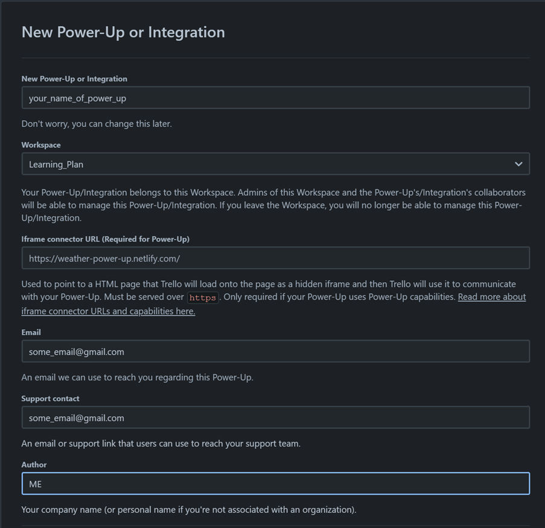

# Trello LeetCoding75 Scheduler 💡

Automate and optimize your LeetCode challenge preparation with the Trello LeetCoding75 Scheduler. This tool helps create a systematic study plan by categorizing challenges on a Trello board based on topic, difficulty, and due dates.

## Features 🌟

- **Trello Integration**: Direct interaction with the Trello API for seamless card, list, and label management.
- **Topic-based Categorization**: Challenges are grouped under topics like Arrays, Two Pointers, Binary Trees, etc., for a comprehensive study approach.
- **Automated Due Dates**: Assigns due dates to challenges, offering a structured study plan.
- **Direct Challenge Links**: Each card contains a direct link to the respective LeetCode challenge for easy access.
- **Customizability**: Modify the script to adapt to individual study plans or different challenge sets.

## Spaced Repetition Learning 🧠🔄

One of the core principles that influenced the design of this scheduler is the concept of **Spaced Repetition**. It's a scientifically-backed learning technique where information is reviewed at increasing intervals, ensuring long-term retention and efficient learning. By spacing out your LeetCode challenges, you're not just practicing but also reinforcing your memory and understanding of algorithms and data structures.

### Why Spaced Repetition?

- **Enhanced Retention**: It reduces the forgetting curve, ensuring that you remember algorithms and solutions for a longer duration.
- **Efficient Learning**: Instead of cramming, spaced repetition promotes steady, incremental learning, which is proven to be more effective.
- **Adaptive**: The technique adjusts to your learning pace. Topics you're familiar with will appear less often, while challenging ones will be reviewed more frequently.

The Trello LeetCoding75 Scheduler inherently supports spaced repetition. By categorizing challenges and automating due dates, you're encouraged to revisit topics and problems periodically, ensuring a deeper understanding and better performance in coding interviews.

## Setup 🛠️

### 1. Obtain API Key from Trello:

- **Login**: Ensure you're logged into your [Trello account](https://trello.com/).
- **Developer Portal**: Navigate to the [Power-Up Admin Portal](https://trello.com/power-ups/admin/).
- **API Key**: View and manage your developer API keys. If you haven't created one, add a new one. Once created, copy and safely store your API key.

    

### 2. Obtain OAuth Token from Trello:

- **Generate Token**: After obtaining your API key, https://trello.com/1/authorize?expiration=1day&name=MyPersonalToken&scope=read,write&response_type=token&key=YOUR_API_KEY. Replace `YOUR_API_KEY` with your Trello API key and navigate to this new URL.
- **Authorize**: Grant the token access to your Trello account.
- **Get Token**: Post authorization, you'll receive an OAuth token. Copy and store it securely.

### 3. Store Tokens as GitHub Secrets:

- **Repository**: Navigate to your GitHub repository.
- **Settings**: Access the Settings tab on your repository page.
- **Secrets**: On the left sidebar, click on Secrets & Variables.
- **Add Secrets**: Click on the `New repository secret` button. Add both `API_KEY` (from step 1) and `TRELLO_OAUTH_TOKEN` (from step 2).

## Usage 🚀

This repository is set up with a GitHub Actions workflow. Once the setup is complete, the script (`leetcode_trello_manager.py`) will automatically run every Monday at 01:00 UTC, as defined in the workflow.

### Manual Trigger (Optional):

If you wish to trigger the script manually:

1. Navigate to the `Actions` tab of your GitHub repository.
2. Select the `Run Trello Script` workflow from the left sidebar.
3. Click on `Run workflow` to manually trigger the script.

Note: Ensure that the secrets (`API_KEY` and `TRELLO_OAUTH_TOKEN`) are set up correctly in the repository for the script to function as expected during the workflow run.

## Troubleshooting 🛠️🔍

During the course of using this scheduler, you might encounter certain issues. Here are some common ones and their solutions:

### GitHub Action Failures:

- **Error Logs**: Always check the error logs provided by GitHub Actions. They can provide insights into what went wrong.
- **Secrets**: Ensure the `API_KEY` and `TRELLO_OAUTH_TOKEN` are correctly set in your repository secrets.
- **Trello Permissions**: The provided API key and OAuth token must have the necessary permissions on Trello to create and manage boards, lists, and cards.

### Trello Authentication Issues:

- **Token Expiry**: If you face authentication issues, it might be because the OAuth token has expired. Follow the steps in the setup section to generate a new token.
- **API Key**: Ensure the API key hasn't been revoked or deleted from the Trello Developer Portal.

If you face an issue that's not listed above, please raise an issue in the GitHub repository, and we'll address it at the earliest.

## Customization 🎨

The Trello LeetCoding75 Scheduler is designed to be flexible and customizable according to your needs. If you'd like to tailor the challenges, scheduling, or any other aspect, here's how you can get started:

1. **Modify Challenges**: The `topics` dictionary in `leetcode_trello_manager.py` contains all the challenges categorized by topics. You can add, remove, or modify challenges as needed.
2. **Adjust Scheduling**: The function `generate_all_due_dates` determines the due dates for challenges. Modify this if you'd like to change the scheduling logic.
3. **Trello Board Customization**: The board name, lists, and other configurations are defined within the script. Adjust these constants and functions to customize the Trello board's appearance and structure.

Remember to thoroughly test your changes locally before deploying them to ensure the scheduler's smooth operation.

## Contribution 🤝

Feel free to fork this repository, make changes, and open a pull request if you think you can make any improvements or have any suggestions.

## License ⚖️

[MIT License](LICENSE)
