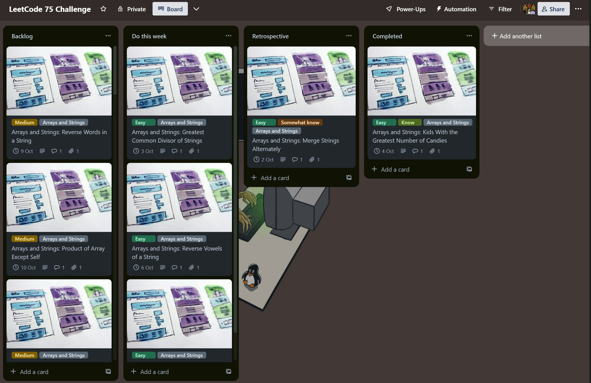

# Trello LeetCoding75 Scheduler 💡

Automate and optimize your LeetCode challenge preparation with the Trello LeetCoding75 Scheduler. This tool helps create a systematic study plan by categorizing challenges on a Trello board based on topic, difficulty, and due dates.

## Features 🌟

- **Trello Integration**: Direct interaction with the Trello API for seamless card, list, and label management.
- **Topic-based Categorization**: Challenges are grouped under topics like Arrays, Two Pointers, Binary Trees, etc., for a comprehensive study approach.
- **Automated Due Dates**: Assigns due dates to challenges, offering a structured study plan.
- **Direct Challenge Links**: Each card contains a direct link to the respective LeetCode challenge for easy access.
- **Customizability**: Modify the script to adapt to individual study plans or different challenge sets.

## Spaced Repetition Learning 🧠🔄

One of the core principles that influenced the design of this scheduler is the concept of **Spaced Repetition**. It's a scientifically-backed learning technique where information is reviewed at increasing intervals, ensuring long-term retention and efficient learning. By spacing out your LeetCode challenges, you're not just practicing but also reinforcing your memory and understanding of algorithms and data structures.

### Why Spaced Repetition?

- **Enhanced Retention**: It reduces the forgetting curve, ensuring that you remember algorithms and solutions for a longer duration.
- **Efficient Learning**: Instead of cramming, spaced repetition promotes steady, incremental learning, which is proven to be more effective.
- **Adaptive**: The technique adjusts to your learning pace. Topics you're familiar with will appear less often, while challenging ones will be reviewed more frequently.

### How It Works:

1. **Weekly Challenges**: 
   - Each week, the scheduler ensures that the 'To Do this Week' list contains the required number of cards, as defined in the settings. 
   - Some cards, based on specific labels, are exempt from this count.

2. **Retrospective Processing**: 
   - Cards in the 'Retrospective' list are periodically processed. 
   - Their due dates and positions are adjusted based on their associated labels:
     - **Do not know**: The challenge is scheduled for the next working day in the 'Do this week' list.
     - **Somewhat know**: The challenge is scheduled for a week later. Depending on the new due date, it might remain in the 'Do this week' list or be moved to the 'Backlog'.
     - **Know**: The challenge is deemed completed and is scheduled for a review four weeks later in the 'Completed' list.

3. **Backlog Management**: 
   - If there's a shortfall in the 'To Do this Week' list, cards from the 'Backlog' are promoted to fill the gap.

## Retrospective Review 📝

After tackling each LeetCode challenge during the week, setting aside time to introspect on your comprehension is pivotal. We've introduced a structured comment to aid this self-assessment, guiding you through:

- **Problem Understanding**: Reevaluate your grasp of the challenge.
- **Solution Strategy**: Deliberate on your chosen methodologies.
- **Efficiency Analysis**: Consider the performance and robustness of your solution.
- **Code Implementation**: Reflect on the coding phase, noting any challenges or revelations.
- **Test Depth**: Gauge the comprehensiveness of your tests and consideration of edge cases.
- **Learning Takeaways**: Identify any new algorithms or concepts you encountered.
- **Solution Benchmarking**: Compare your method with alternatives in terms of simplicity and efficiency.
- **Future Adaptations**: Think about potential variations of the problem and how you'd adapt your strategy.

### Review Process:

1. **Card Movement**: After your self-assessment, manually move the challenge card from the 'To Do this Week' list to the 'Retrospective' list on Trello. (Will update this to move automatically in future)
2. **Label Assignment**: Within the 'Retrospective' list, apply one of the following labels to the card based on your understanding:
   - **Know**: You feel confident about your grasp and solution.
   - **Somewhat Know**: You understand the basics but had certain uncertainties.
   - **Do Not Know**: You found the challenge particularly tough and had difficulties.

### Spaced Repetition Integration:

Once you've labeled your challenges in the 'Retrospective' list:

1. **Pipeline Execution**: 
   - **Manual Trigger**: If you wish to see the changes reflected immediately, navigate to the `Actions` tab of your GitHub repository, select the appropriate workflow, and manually trigger the pipeline.
   - **Scheduled Run**: Alternatively, if you prefer to wait, the pipeline is set to run automatically at 01:00 UTC every Monday.
2. **Label-Based Scheduling**: 
   - **Know**: Challenges labeled as "Know" are scheduled for infrequent reviews, ensuring you're revisiting them just enough to retain your understanding.
   - **Somewhat Know**: These challenges are scheduled for moderate frequency, allowing you to reinforce and solidify your understanding over time.
   - **Do Not Know**: Challenges with this label are set for more frequent reviews, ensuring you get ample practice until you're confident.

## Setup 🛠️

### 1. Obtain API Key from Trello:

- **Login**: Ensure you're logged into your [Trello account](https://trello.com/).
- **Developer Portal**: Navigate to the [Power-Up Admin Portal](https://trello.com/power-ups/admin/).
- **API Key**: View and manage your developer API keys. If you haven't created one, add a new one. Once created, copy and safely store your API key.

    

### 2. Obtain OAuth Token from Trello:

- **Generate Token**: After obtaining your API key, https://trello.com/1/authorize?expiration=1day&name=MyPersonalToken&scope=read,write&response_type=token&key=YOUR_API_KEY. Replace `YOUR_API_KEY` with your Trello API key and navigate to this new URL.
- **Authorize**: Grant the token access to your Trello account.
- **Get Token**: Post authorization, you'll receive an OAuth token. Copy and store it securely.

### 3. Store Tokens as GitHub Secrets:

- **Repository**: Navigate to your GitHub repository.
- **Settings**: Access the Settings tab on your repository page.
- **Secrets**: On the left sidebar, click on Secrets & Variables.
- **Add Secrets**: Click on the `New repository secret` button. Add both `API_KEY` (from step 1) and `TRELLO_OAUTH_TOKEN` (from step 2).

## Usage 🚀

This repository is set up with a GitHub Actions workflow. Once the setup is complete, the script (`leetcode_trello_manager.py`) will automatically run every Monday at 01:00 UTC, as defined in the workflow.

### Manual Trigger (Optional):

If you wish to trigger the script manually:

1. Navigate to the `Actions` tab of your GitHub repository.
2. Select the `Run Trello Script` workflow from the left sidebar.
3. Click on `Run workflow` to manually trigger the script.

Note: Ensure that the secrets (`API_KEY` and `TRELLO_OAUTH_TOKEN`) are set up correctly in the repository for the script to function as expected during the workflow run.

## Troubleshooting 🛠️🔍

During the course of using this scheduler, you might encounter certain issues. Here are some common ones and their solutions:

### GitHub Action Failures:

- **Error Logs**: Always check the error logs provided by GitHub Actions. They can provide insights into what went wrong.
- **Secrets**: Ensure the `API_KEY` and `TRELLO_OAUTH_TOKEN` are correctly set in your repository secrets.
- **Trello Permissions**: The provided API key and OAuth token must have the necessary permissions on Trello to create and manage boards, lists, and cards.

### Trello Authentication Issues:

- **Token Expiry**: If you face authentication issues, it might be because the OAuth token has expired. Follow the steps in the setup section to generate a new token.
- **API Key**: Ensure the API key hasn't been revoked or deleted from the Trello Developer Portal.

If you face an issue that's not listed above, please raise an issue in the GitHub repository, and we'll address it at the earliest.

## Customization 🎨

The Trello LeetCoding75 Scheduler is designed to be flexible and customizable according to your needs. Here's how you can adjust the settings to match your preferences:

### 1. Modifying the Problem Sets 🧩

The problem sets are organized into various categories like "Arrays and Strings", "Two Pointers", "Sliding Window", and so on. Each problem has a title and an associated difficulty. 

To adjust the problems:
- Open the provided JSON file.
- Under the desired category, you can add, remove, or modify problems as you see fit.
- Ensure each problem has a "title" and a "difficulty" key.

### 2. Adjusting Trello Settings ⚙️

The settings for interacting with Trello are contained within the `settings.ini` file. Here's how you can modify them:

- **Week Settings**: The `[WEEK]` section contains the details about the workweek. Adjust `START_DAY`, `END_DAY`, and `WORKDAYS` according to your work schedule.
- **Labels**: The `[LABELS]` section defines the default colors for various difficulty levels or problem statuses. Modify the `DEFAULT_COLORS` setting to add or change label colors.
- **Problems Per Day**: Under the `[PROBLEMS]` section, you can set the `PROBLEMS_PER_DAY` to determine how many problems you want to tackle each day.

## Contribution 🤝

Feel free to fork this repository, make changes, and open a pull request if you think you can make any improvements or have any suggestions.

## License ⚖️

[MIT License](LICENSE)
